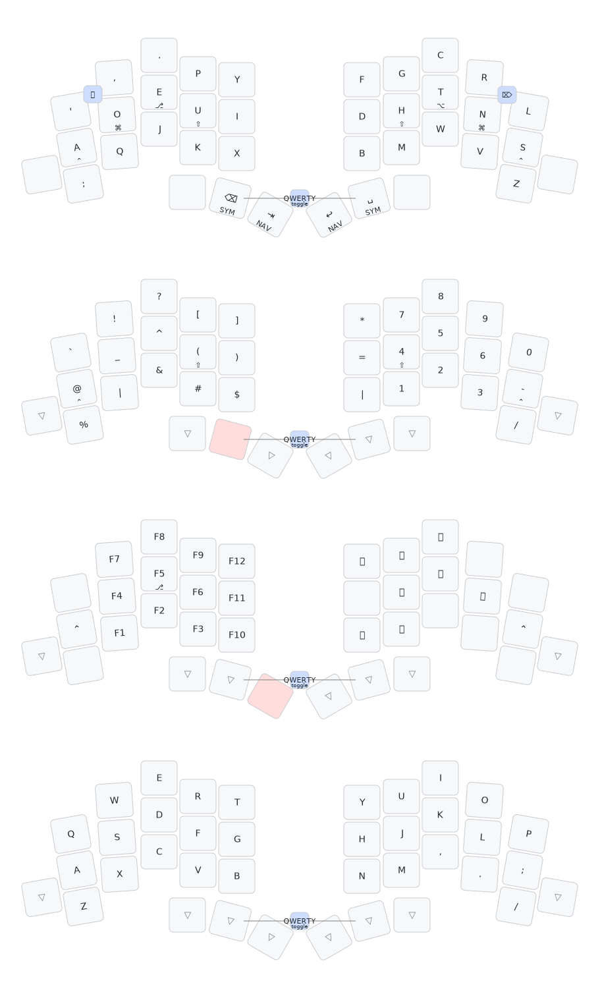

  

# Totemist - Dvorak Layout

A Dvorak layout for the 3x5 [Totemist - Executive Edition](https://ergomech.store/shop/totemist-executive-edition-513). Features:

Layer |       |
------|-------
**Dvorak** | Homerow mod keys for `⌃` `⌘` `⎇` `⇧`   `⌫` `⇥` and `⮐` `␣` under thumbkeys   `⎋` and `⌦` chorded on top left/right pairs   Ambidextrous layer shift keys for **Sym/Num** and **Fn** layers
**Symbols \| Numpad** | Numpad on RH   Symbol pairs on LH `[]` `()` `#$` `!?` `_^` `\|&` `+-` `\/`   `-` `/` in same relative pinky position as on Dvorak standard layout
**Fn keys \| DPad** | Fn keys on LH   DPad on RH homerow base   `🔉🔊` `🔅🔆` above/below DPad
**QWERTY/Gaming** | 

